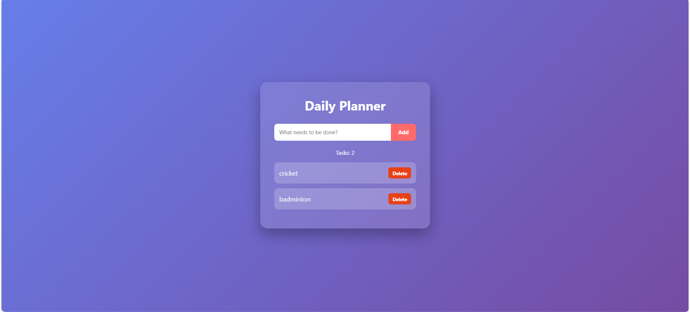

#  To-Do List Web App

A modern and responsive To-Do List web application built using **HTML, CSS, and Vanilla JavaScript**.

## Project Overview

This application allows users to:

- Add tasks dynamically
- Mark tasks as completed (toggle class)
- Delete tasks
- View total task count
- Add tasks using the Enter key
- Experience smooth modern UI design

The UI is designed using a glassmorphism style with gradient background and animations.

---

##  Technologies Used

- HTML5 (Semantic Structure)
- CSS3 (Flexbox, Animations, Glass UI)
- JavaScript (DOM Manipulation, Event Handling)

---

##  Features

- Add new tasks
- Mark tasks as complete (line-through effect)
- Delete tasks instantly
- Dynamic task counter
- Enter key support
- Responsive design
- Clean and modern UI

---

##  JavaScript Concepts Used

- DOM Selection (`getElementById`)
- Event Listeners (`addEventListener`)
- Dynamic Element Creation (`createElement`)
- Class Toggling (`classList.toggle`)
- Event Propagation (`stopPropagation`)
- State Management (Task Counter)

##  Project Preview

